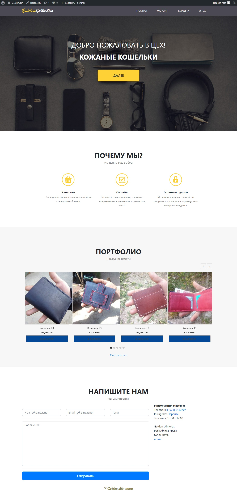

Responsive and cross-browser compatibility web design. 
How to install (need Wordpress latest version)
===
1. Download->install->activate theme.
2. Install 3 plugins https://docs.woocommerce.com/documentation/plugins/woocommerce/getting-started/installation-and-updating/ and "https://wordpress.org/plugins/woo-product-slider/", https://wordpress.org/plugins/contact-form-7/
3. Setting up your website params. Create woocommerce products. Paste the PHP code "slider" into your template "index.php" file.
4. Create new contact form 7 FORM, paste here html from Contactform7.txt, and put into index.php form code  with u id. for exampe: [contact-form-7 id="71" title="Form"]
4. Enjoy.
Good luck!

<h1>Адаптивность</h1>
<h1>Пк</h1>

<h1>Планшет</h1>

<h1>Смартфон</h1>

